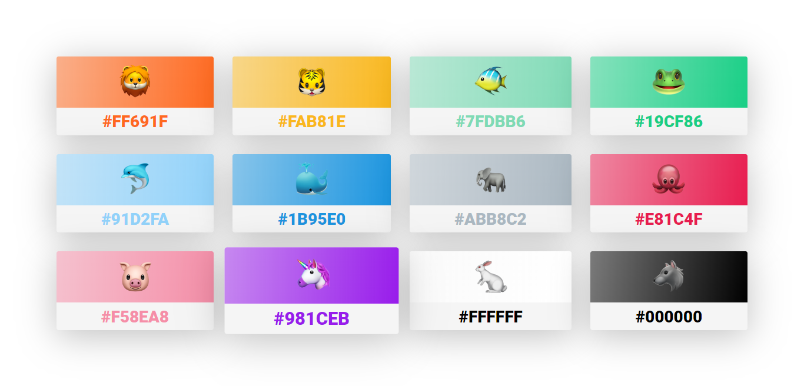

<h1 align="center">🤗 Emoji Click 👆</h1>

Beautiful emoji Web App

<a href="https://360macky.github.io/clickmoji/">🦄 Launch the app 🚀</a>

🖌️ One click in one emoji and change the color 🎨

## 📝 Development
This project was created using the <a href="https://scrimba.com/course/glearnvue">Vue.js course</a> of Scrimba.
